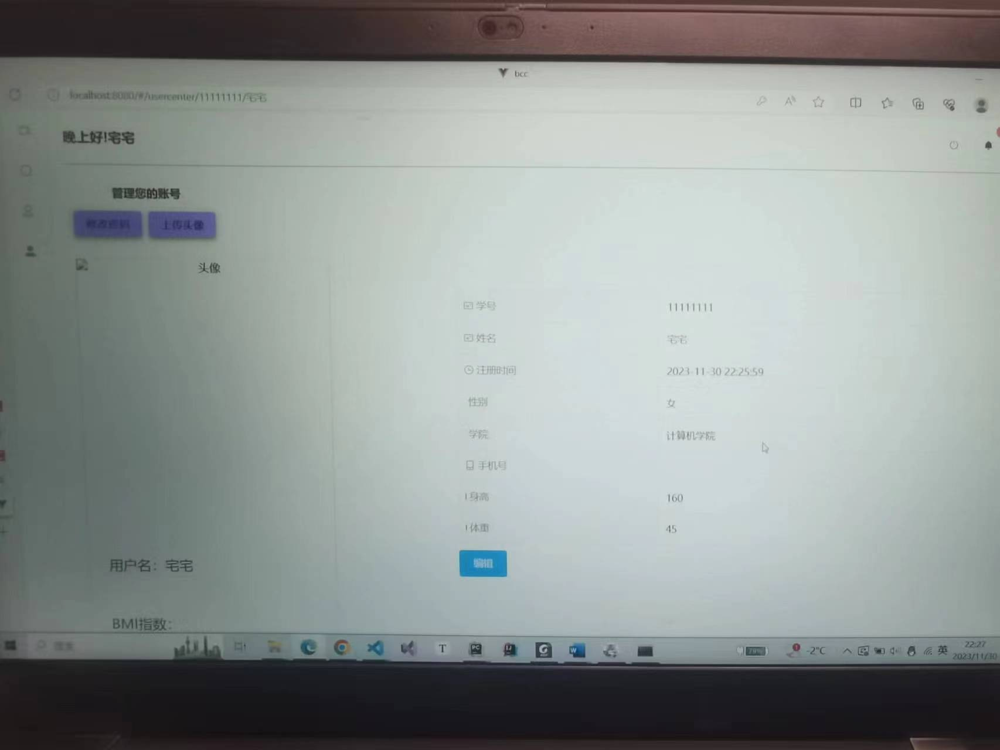
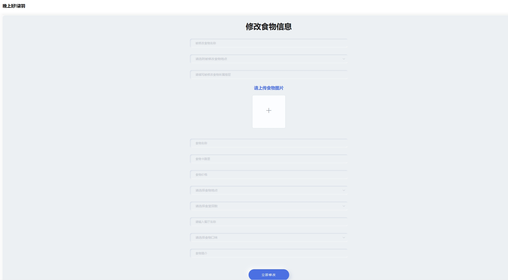

# 2023数据库大作业

北航三餐生成系统（`Buaa Club Center`）

前端：vue

后端：django

相关的版本号标注在`requirements.txt`中

制作了北航三餐生成系统

主要的功能有浏览北航的食堂和周边的外卖数据，并且可以根据个人BMI动态生成食谱

部分功能展示如下

## 个人页面展示

## 食堂浏览

## 添加食物

## 动态生成食谱

